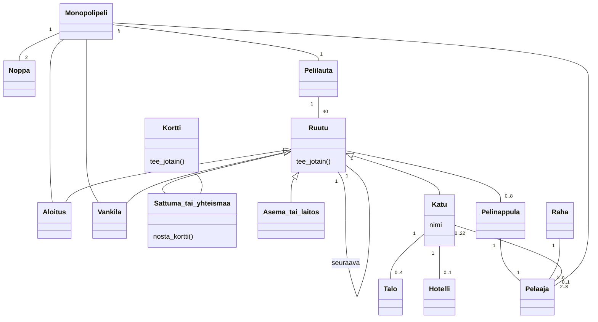

```mermaid
 classDiagram
    Monopolipeli "1" -- "2" Noppa
    Monopolipeli "1" -- "1" Pelilauta
    Monopolipeli -- Aloitus
    Monopolipeli -- Vankila
    Pelilauta "1" -- "40" Ruutu
    Ruutu: tee_jotain()
    Ruutu "1" -- "1" Ruutu : seuraava
    Ruutu <|-- Aloitus
    Ruutu <|-- Vankila
    Ruutu <|-- Sattuma_tai_yhteismaa
    Kortti -- Sattuma_tai_yhteismaa
    Sattuma_tai_yhteismaa: nosta_kortti()
    Kortti: tee_jotain()
    Ruutu <|-- Asema_tai_laitos
    Ruutu <|-- Katu
    Katu : nimi
    Katu "1" -- "0..4" Talo
    Katu "1" -- "0..1" Hotelli

    Ruutu "1" -- "0..8" Pelinappula
    Pelinappula "1" -- "1" Pelaaja
    Pelaaja "2..8" -- "1" Monopolipeli
    Raha "1" -- "1..n" Pelaaja
    Katu "0..22" -- "0..1" Pelaaja
```