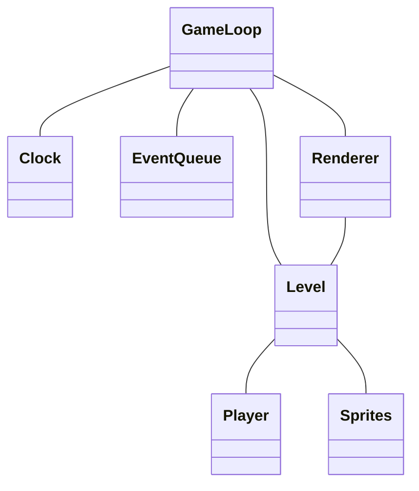
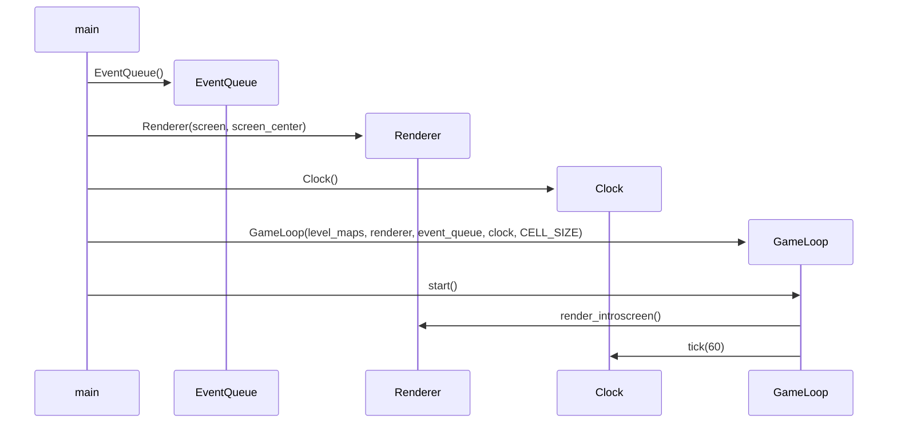

# Arkkitehtuurikuvaus

## Rakenne

Ohessa on sovelluksen rakenne yksinkertaistettuna. Sprites sisältää kaikki muut spritet kuin pelaajan, kuten kolikot, tasot jne.

## Toiminnallisuus

Seuraavassa kaaviossa on kuvattuna pelin käynnistyminen ensimmäiseen pelisilmukkaan asti. Ensimmäisessä silmukassa on pelin aloitusruutu.

