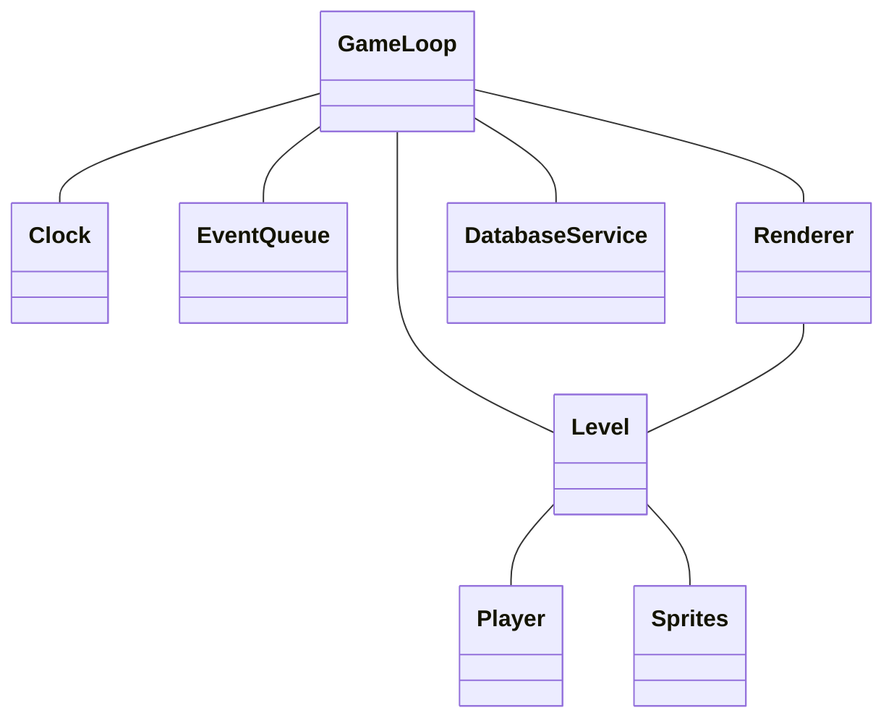
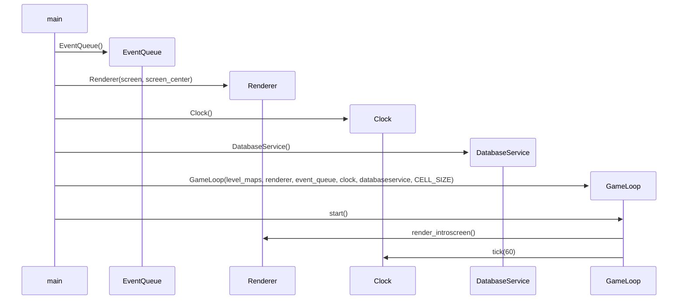

# Arkkitehtuurikuvaus

## Rakenne

Ohessa on sovelluksen rakenne yksinkertaistettuna. Sprites sisältää kaikki muut spritet kuin pelaajan, kuten kolikot, tasot jne.

 

## Käyttöliittymä

Käyttöliittymässä on yksi ruutu, jossa on neljä eri näkymää:
- perusnäkymä (aloitusruutu)
- tallennuspaikan valinta
- kentän valinta
- kenttä (itse peli).

Näkymät on toteutettu silmukoina GameLoop-luokassa, ja niiden näyttämisestä vastaa Renderer-luokka. Rendereriä kutsutaan jatkuvasti jokaisessa silmukassa, jotta oikeat asiat piirtyvät ruudulle. Kenttien sisällöstä vastaa Level-luokka, ja kullakin spritellä on oma luokkansa.

## Toiminnallisuus

Seuraavassa kaaviossa on kuvattu pelin käynnistyminen ensimmäiseen pelisilmukkaan asti. Ensimmäisessä silmukassa on pelin aloitusruutu.

Käytännössä GameLoop-luokalle syötetään muut toiminnallisuutta tuottavat luokat, joita GameLoop kutsuu.

 

## Pysyvä tieto

### Pelaajan edistymisen tallennus eri paikoille

Pelaajan edistyminen talletetaan pysyvään lokaaliin SQLite-tietokantaan. Tallentamisen toteuttaa `DatabaseService`-luokka. Testejä varten luodaan oma tietokantatiedosto, jotta testit eivät vaikuttaisi pelin toimintaan.

SQLite-tietokanta on sopiva, sillä talletettu tieto on hyvin yksinkertaista. Tietokantaan kuuluu vain kolme taulua: `Slots`, `Levels` ja `SlotsLevels`. `Slots` sisältää kolme riviä, joilla on tallennuspaikan numero (1-3) ja korkein saavutettu kenttä. `Levels` pitää sisällään tasojen id:t, kolikot ja tähdet. `SlotsLevels` taas sisältää paikan ja kentän id:n, kerätyt kolikot ja kerätyt tähdet. `DatabaseService` tarkkailee edistymistä tasoilla näiden taulujen perusteella.

### Kenttien lukeminen tiedostoista

Kentät ovat yksinkertaisia listoja listoista, joten ne on tallennettu json-tiedostoon. Tiedosto luetaan käynnistyksen yhteydessä ja muunnetaan listaksi, joka annetaan parametrinä `GameLoop`-luokalle.