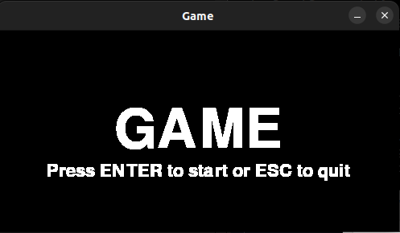
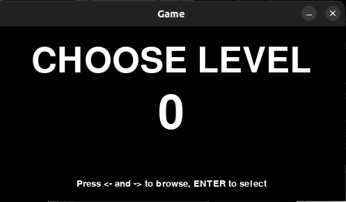
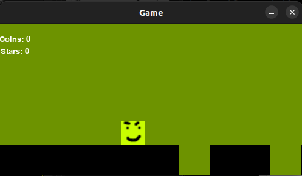

# Käyttöohje

Lataa ensin viimeisimmän [julkaisun](https://github.com/kortekoski/ot-harjoitustyo/releases) lähdekoodi.

## Asentaminen

Hakeudu kansioon, johon purit lähdekoodin, ja asenna riippuvuudet:

```bash
poetry install
```

## Käyttäminen

Ohjelma käynnistyy seuraavalla komennolla:

```bash
poetry run invoke start
```

Aloitusruutu aukeaa. Näkymästä pääsee päävalikkoon painamalla enteriä. Jos kadut päätöstäsi, peli sulkeutuu escillä.



Seuraavassa ruudussa valitaan kenttä nuolinäppäimillä, minkä jälkeen peli alkaa enterillä.



Tämän jälkeen pääset itse pelinäkymään:



Peli liikkuu itsestään. Tavoitteena on päästä tason loppuun ja kerätä mahdollisia kolikoita tai tähtiä. Jos hahmo putoaa ruudusta tai jää ruudun vasempaan laitaan, kenttä on epäonnistunut. Tällöin pelaaja voi aloittaa kentän alusta tai palata päävalikkoon.

## Näppäimet

Tässä on vielä esitettynä näppäimet, joilla peliä ohjataan.

### Alkunäkymä

- Enter: Aloittaa pelin.
- Escape: Sulkee pelin.

### Valikkonäkymä

- Nuolinäppäimet: Valitsee kentän.
- Enter: Aloittaa valitun kentän pelaaminen.
- Escape: Sulkee pelin.

### Pelinäkymä

- Välilyönti: Hyppää. Näppäimen pohjassa pitäminen tekee hypystä korkeamman.
- Z: Lyö. Nyrkki tuhoaa pyöreät kiviesteet.
- P: Pysäyttää pelin (pause). Kun peli on pysäytetty, P jatkaa peliä.
- R: Aloittaa kentän alusta.
- Escape: Sulkee pelin. Kun peli on pausella tai pelaaja on epäonnistunut tasossa, palaa valikkonäkymään.
- Enter: Palaa valikkonäkymään, kun kenttä on läpäisty.