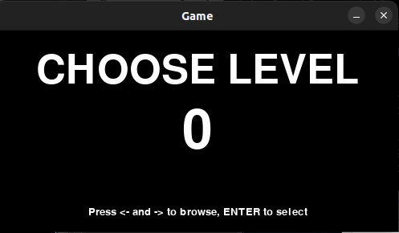

# Testausdokumentti

Ohjelmaa on testattu automaattisesti (yksikkötestit) ja manuaalisesti (järjestelmätestit). Koska kyseessä on peli, manuaalinen testaaminen on yksinkertaista ja pelattavuuden kannalta myös järkevää.

## Yksikkötestaus

Kullakin luokalla on oma testiluokka, joka testaa luokan yksittäisiä ominaisuuksia. Testiluokat on nimetty malliin `TestClass`. Jotta tietokannan testaaminen ei vaikuttaisi muuhun sovellukseen, testaamista varten luodaan oma tietokantatiedosto.

### Testauskattavuus
Testikattavuus on 70 %.

Testaamatta on jäänyt etenkin `Renderer`-luokka (onko mielekästä) ja `GameLoop`-luokka, sillä sen testaaminen on hyvin hankalaa. Viime hetkillä löydetty MagicMock voisi olla ratkaisu testikattavuuden lisäämiseen.

## Järjestelmätestaus

Käytännössä suurin osa testaamisesta on suoritettu manuaalisesti. Peliä on pelattu, eli esimerkiksi hahmon liikkumista on kehitetty avaamalla kenttä ja liikkumalla nuolinäppäimillä. Kutakin määrittelydokumentissa esitettyä toiminnallisuutta on kokeiltu ja sen jälkeen on todettu, että se toimii.

